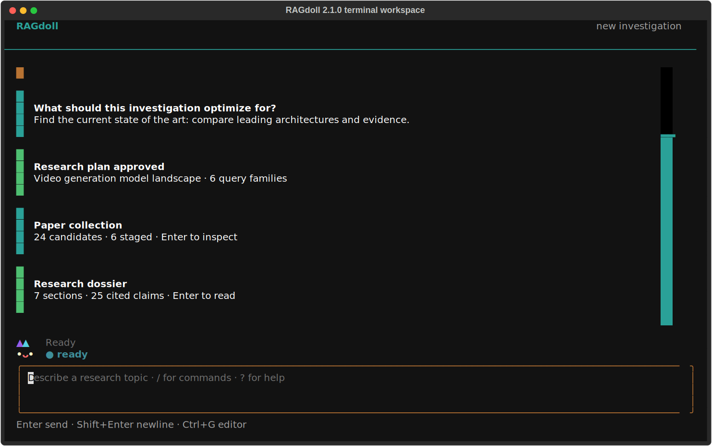

<div align="center">
  
  <h1>RAGdoll</h1>
  <p><strong>Turn a research question into an explainable, cited literature dossier—from your terminal.</strong></p>
  <p>Adaptive scoping, editable search plans, transparent ranking, local evidence, and auditable claims.</p>

  [](https://github.com/almondsun/ragdoll/actions/workflows/ci.yml)
  [](https://almondsun.github.io/ragdoll/)
  [](pyproject.toml)
  [](LICENSE)
</div>

RAGdoll is an agentic research workspace for SOTA acceleration. It begins with an ambiguous goal,
asks the pivotal questions that change the investigation, proposes an editable literature-search
plan, and waits for approval before searching. It then discovers, deduplicates, reranks, and stages
a diverse collection of scholarly papers with visible reasons and provenance. With a second,
explicit approval, it downloads available open PDFs, builds a local page-aware evidence index, and
produces a claim-level cited research dossier that can be questioned from the same terminal.

<p align="center">
  
</p>

## The interaction

`ragdoll` opens a fullscreen, keyboard-first research conversation. Its adaptive interview uses
focused selection dialogs with exactly three proposed answers and a fourth custom answer. The
approved plan, paper collection, evidence acquisition, dossier, and grounded answers appear as
compact timeline cards; focus a card and press `Enter` to inspect its full detail.

RAGdoll asks at most six adaptive questions. The model supplies exactly three proposed answers;
the terminal owns the fourth custom-answer option. The resulting brief and query plan are shown for
editing and explicit approval before any scholarly API is contacted.

After discovery, use the redesigned v2 commands:

```text
/papers                         browse, inspect, stage, and unstage
/plan                           inspect the approved plan
/dossier                        build or read the cited dossier
/dossier refresh Open questions regenerate one section
/ask Which limitations recur?   ask against indexed evidence
/evidence chunk-...             inspect an exact cited passage
/sources                        audit evidence provenance
/export                         write Markdown, BibTeX, and JSON
/purge                          delete local evidence after confirmation
```

Type `/` for completion or `?` on an empty composer for help. `Shift+Enter`/`Ctrl+J` inserts a
newline, `Ctrl+R` recalls matching history, and `Ctrl+G` opens `$VISUAL` or `$EDITOR`. Interactive
mode requires a TTY and an `80 x 24` terminal; `investigations`, `show`, `export`, and `doctor`
remain conventional shell commands for automation and troubleshooting.

## Install

```bash
git clone https://github.com/almondsun/ragdoll.git
cd ragdoll
uv sync --extra dev --extra docs
```

Choose a provider:

```bash
export OPENAI_API_KEY=...
uv run ragdoll

# or, fully local model inference with Ollama
ollama pull qwen3:4b
uv run ragdoll --provider ollama
```

OpenAI uses the Responses API. The default fast and quality models are configurable through
`RAGDOLL_OPENAI_FAST_MODEL` and `RAGDOLL_OPENAI_QUALITY_MODEL`. Ollama defaults to loopback
`http://127.0.0.1:11434` with `qwen3:4b`. A remote HTTPS endpoint requires explicit user opt-in
through `RAGDOLL_ALLOW_REMOTE_OLLAMA=true` or `--allow-remote-ollama`; project-local configuration
cannot enable or redirect it. The evidence consent dialog names the actual endpoint and model.

## What is explainable

- The original prompt and every clarification answer
- Every plan revision and explicit approval boundary
- Exact source queries and retrieval timestamps
- DOI/arXiv/title-based version grouping and deduplication
- Reciprocal-rank, relevance, and criteria-fit score components
- Why each paper was staged and every later human override
- Whether each claim came from full text or an abstract fallback, including page/chunk locators
- The exact bounded evidence used for every dossier claim and grounded answer

OpenAlex provides broad scholarly discovery, Crossref canonicalizes DOI metadata, and arXiv enriches
preprint records. Coverage varies by field, language, venue, and date; a RAGdoll collection is a
reproducible search result, not the literature itself.

## OpenAI Build Week

RAGdoll was created during the July 2026 OpenAI Build Week submission period. The dated history
shows the progression from the initial research preview (`a799ab3`) to the evidence workflow
(`e38a08e`), fullscreen terminal experience (`379d1ee`), and hardened v2.2 research contracts
(`23e8692`).

Codex was the primary engineering collaborator throughout that work. It accelerated repository
analysis, implementation, test generation, security review, interface refinement, validation, and
the reproducible submission media. I retained the product decisions: researchers approve searches
and evidence acquisition separately; the application owns retrieval and persistence; model output
must pass Pydantic validation; and citations must resolve to evidence actually supplied for
synthesis.

The cloud provider uses the OpenAI Responses API and defaults to `gpt-5.6-luna` for interactive
work and `gpt-5.6-terra` for quality-sensitive synthesis. Those identifiers and the structured-
output adapter are implemented and contract-tested. The documented acceptance investigation and
Build Week video were completed locally with Ollama and `qwen3:4b`; they do not simulate or claim a
successful paid GPT-5.6 request. This distinction is preserved because provider provenance is part
of RAGdoll's research contract.

Judges can inspect a complete, synthetic sample with no key, model download, or network call:

```bash
uvx --from git+https://github.com/almondsun/ragdoll ragdoll demo --no-animation
```

The demo launches the real Textual workspace with an approved plan, staged papers, evidence
sources, a seven-section dossier, and resolvable passages. It is explicitly labeled as an offline
sample and discarded on exit. See [JUDGING.md](JUDGING.md) for the shortest test path and the full
provider setup.

## Development

```bash
uv run make check
uv run make brand       # regenerate SVG and PNG identity assets
uv run make screenshot  # regenerate the deterministic README TUI captures
```

Normal CI is offline: provider and scholarly-source behavior is tested through strict contracts and
recorded fixtures. Live smoke tests require the corresponding API secret or local runtime.

Read the [architecture](docs/architecture.md), [planning contract](docs/planning-contract.md),
[ranking methodology](docs/retrieval-and-ranking.md),
[evidence and dossier contract](docs/evidence-and-dossiers.md), and
[privacy model](docs/privacy.md) before extending the workflow.

## Status

The unreleased v2.2 hardening branch binds approvals and derived outputs to canonical fingerprints,
enforces approved source/date constraints, persists exact retrieval hits, and hardens local write
and extraction boundaries. Release remains blocked until the checked-in three-arm benchmark has
maintainer-adjudicated relevance labels and passes every documented gate.

`v2.1.0` preserves the completed research contract and presents its interactive surface as a
fullscreen, conversation-first terminal workspace with the continuously animated `3 x 2` M2 cat
companion in a persistent activity rail.
Existing v1 investigations, SQLite workspaces, provider settings, and export formats remain
compatible; only the in-app slash vocabulary changed in v2.0.0.
RAGdoll does not bypass paywalls, perform OCR, claim exhaustive coverage, prove novelty, or replace
expert review. Research-gap validation and autonomous experiment design remain outside the current
project scope.
