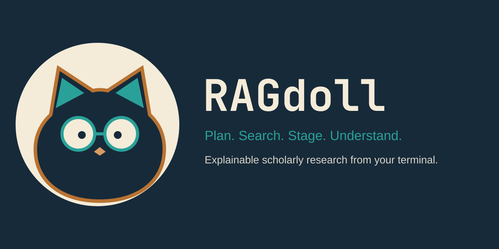

<div align="center">
  

  <p><strong>Turn an ambiguous research question into an explainable, cited literature dossier—from your terminal.</strong></p>
  <p>Human-approved search · transparent ranking · local evidence · passage-level citations</p>

  [](https://github.com/almondsun/ragdoll/actions/workflows/ci.yml) [](https://almondsun.github.io/ragdoll/) [](pyproject.toml) [](pyproject.toml) [](LICENSE)

  [Watch the 2:37 demo](https://www.youtube.com/watch?v=aytzIq-5S5k) · [Try the no-key sample](#try-it-in-one-command) · [Read the docs](https://almondsun.github.io/ragdoll/) · [View the Build Week submission](https://devpost.com/software/ragdoll-xfwzms)
</div>

RAGdoll is a keyboard-first workspace for planning scholarly searches, curating paper collections,
acquiring approved open evidence, and producing cited research dossiers. The model proposes; the
researcher approves. The application preserves the queries, rankings, decisions, evidence level,
and exact passage behind every accepted claim.

It never scrapes Google Scholar, bypasses paywalls, or says a paper was read when only metadata or
an abstract was available.

## Try it in one command

Launch a deterministic sample of the real Textual workspace directly from GitHub:

```bash
uvx --from git+https://github.com/almondsun/ragdoll ragdoll demo --no-animation
```

The sample requires Python 3.11+ and an interactive terminal, but no API key, model download, or
network call after installation. It includes an approved plan, three staged papers, indexed
evidence, a seven-section dossier, and resolvable passage citations. The temporary workspace is
discarded on exit.

<p align="center">
  
</p>

See [JUDGING.md](JUDGING.md) for the shortest inspection path and full provider setup.

## Why RAGdoll

| Research risk | RAGdoll's contract |
| --- | --- |
| A plausible answer hides how it was found | Persist every query, source identifier, retrieval time, and score component |
| The model silently changes the investigation | Require approval for the brief, search plan, paper collection, and evidence acquisition |
| Metadata is presented as if it were full text | Label metadata, abstract fallbacks, and open full text separately |
| Citations look valid but do not support a claim | Resolve citations only to passages supplied for that model call |
| Changed inputs leave stale conclusions behind | Bind approvals and derived outputs to canonical fingerprints |
| Remote content crosses local trust boundaries | Validate URLs and redirects, cap downloads, and isolate PDF extraction |

## Product workflow

```text
question
  → adaptive clarification
  → editable brief and query plan
  → explicit search approval
  → OpenAlex + arXiv discovery and Crossref canonicalization
  → transparent reranking and human paper curation
  → explicit full-text consent
  → local page-aware evidence index
  → checkpointed cited dossier and grounded questions
```

RAGdoll asks only clarification questions that can change the search. The model supplies exactly
three proposed answers; the client owns the fourth “Enter my own answer” option. No scholarly API
is contacted until the researcher approves the plan.

After discovery, reciprocal-rank fusion combines query results. DOI, arXiv, and normalized-title
fingerprints group versions, while visible score components and rationales support human staging.
Open PDFs are acquired only after a second approval and indexed locally with page-aware locators.

<p align="center">
  
</p>

## Work from one terminal

The approved plan, paper collection, evidence sources, dossier, and answers live in a compact
research timeline. Focus a card and press `Enter` to inspect its full detail.

```text
/papers                         browse, inspect, stage, and unstage
/plan                           inspect the approved plan
/dossier                        build or read the cited dossier
/dossier refresh Open questions regenerate one section
/ask Which limitations recur?   ask against indexed evidence
/evidence chunk-...             inspect an exact cited passage
/sources                        audit evidence provenance
/export                         write Markdown, BibTeX, and JSON
/purge                          delete local evidence after confirmation
```

Type `/` for completion or `?` on an empty composer for help. `Shift+Enter`/`Ctrl+J` inserts a
newline, `Ctrl+R` recalls matching history, and `Ctrl+G` opens `$VISUAL` or `$EDITOR`. Interactive
mode requires a TTY at least `80 × 24`; `investigations`, `show`, `export`, and `doctor` remain
conventional shell commands for automation and troubleshooting.

## Evidence you can inspect

Every accepted dossier citation resolves to the bounded evidence supplied for synthesis. RAGdoll
preserves:

- the original prompt, clarification answers, plan revisions, and approval fingerprints;
- exact discovery queries, source identifiers, retrieval timestamps, and raw retrieval hits;
- version grouping, reciprocal-rank, relevance, and criteria-fit components;
- every staging decision and later human override;
- full-text versus abstract-fallback evidence levels;
- page, chunk, and source locators for cited passages;
- Markdown, BibTeX, JSON, provenance, and cited-evidence exports.

<p align="center">
  
</p>

OpenAlex provides broad scholarly discovery, Crossref canonicalizes DOI metadata, and arXiv
enriches preprint records. Coverage varies by field, language, venue, and date: a RAGdoll collection
is a reproducible search result, not the literature itself.

## Architecture and safety

Model reasoning stays behind a narrow provider adapter and Pydantic structured-output contracts.
The application—not the model—owns retrieval, file access, persistence, validation, approvals, and
export.

- OpenAI uses the Responses API; Ollama provides a local inference path.
- SQLite stores the investigation, exact provenance, and an FTS5 evidence index.
- Remote URLs and connected peers are validated before downloads proceed.
- PDF size, page count, redirects, and extraction resources are bounded.
- Extraction runs in an isolated worker; document content is treated as untrusted input.
- Model output cannot enter domain logic until it passes schema and domain validation.
- Provider, endpoint, and model provenance remain explicit throughout the workspace.

Read the [architecture](docs/architecture.md), [privacy model](docs/privacy.md), and
[evidence contract](docs/evidence-and-dossiers.md) for the complete boundaries.

## Install and configure

```bash
git clone https://github.com/almondsun/ragdoll.git
cd ragdoll
uv sync --extra dev --extra docs
```

Choose a provider:

```bash
# OpenAI Responses API
export OPENAI_API_KEY=...
uv run ragdoll

# Or fully local inference with Ollama
ollama pull qwen3:4b
uv run ragdoll --provider ollama
```

The OpenAI fast and quality roles are configurable through `RAGDOLL_OPENAI_FAST_MODEL` and
`RAGDOLL_OPENAI_QUALITY_MODEL`. Ollama defaults to `qwen3:4b` on loopback
`http://127.0.0.1:11434`. A remote HTTPS Ollama endpoint requires explicit user opt-in through
`RAGDOLL_ALLOW_REMOTE_OLLAMA=true` or `--allow-remote-ollama`; project-local configuration cannot
enable or redirect it. The evidence-consent dialog names the actual endpoint and model.

## Documented acceptance run

The preserved July 15, 2026 acceptance investigation demonstrates the complete workflow:

| Result | Recorded value |
| --- | ---: |
| Discovery candidates | 24 |
| Human-curated papers | 6 |
| Open full-text documents | 5 |
| Labeled abstract fallbacks | 1 |
| Page-aware evidence chunks | 307 |
| Dossier sections | 7 |
| Directly supported claims in manual audit | 23 / 25 |

Every citation identifier resolved to evidence supplied for its corresponding model call. Two
claims failed direct-passage support in the manual audit and remain documented: citation integrity
does not by itself prove semantic entailment.

<p align="center">
  
</p>

## OpenAI Build Week

<p align="center">
  <a href="https://www.youtube.com/watch?v=aytzIq-5S5k">
    
  </a>
</p>

RAGdoll was created during the July 2026 OpenAI Build Week submission period. Its dated history
shows the progression from the initial research preview (`a799ab3`) through the evidence workflow
(`e38a08e`), fullscreen terminal experience (`379d1ee`), and hardened v2.2 research contracts
(`23e8692`).

Codex was the primary engineering collaborator for repository analysis, implementation, tests,
security hardening, terminal UX refinement, validation, and reproducible media production. The
human product decisions remained explicit: the model proposes while the researcher approves;
retrieval and persistence are application-owned; changed inputs invalidate stale outputs; and
citation integrity is verified separately from entailment.

The cloud provider implements the OpenAI Responses API with configured `gpt-5.6-luna` and
`gpt-5.6-terra` roles and contract-tested structured outputs. The documented acceptance run and
submitted video use local Ollama with `qwen3:4b`; they do not simulate or claim a successful paid
GPT-5.6 request. A minimal live request was attempted but blocked by API quota. This distinction is
preserved because honest provider provenance is part of RAGdoll's product contract.

- [Devpost submission](https://devpost.com/software/ragdoll-xfwzms)
- [Video demo](https://www.youtube.com/watch?v=aytzIq-5S5k)
- [Submission media archive](docs/assets/OpenAI%20Build%20Week/README.md)
- [Judge guide](JUDGING.md)

## Development

```bash
uv run make check       # format check, lint, strict typing, tests, coverage, build
uv run make brand       # regenerate SVG and PNG identity assets
uv run make screenshot  # regenerate deterministic terminal captures
```

Normal CI is offline. Provider and scholarly-source behavior is tested through strict contracts
and recorded fixtures; live smokes require the corresponding API secret or local runtime.

Further reading:

- [Planning contract](docs/planning-contract.md)
- [Retrieval and ranking](docs/retrieval-and-ranking.md)
- [Evidence and dossiers](docs/evidence-and-dossiers.md)
- [Evaluation](docs/evaluation.md)
- [Terminal experience](docs/terminal-experience.md)
- [Security policy](SECURITY.md)
- [Contributing](CONTRIBUTING.md)

## Status and limitations

Current `main` targets RAGdoll 2.2.0. Release remains gated on the checked-in three-arm benchmark
receiving maintainer-adjudicated relevance labels and passing every documented quality gate.

Existing investigations, SQLite workspaces, provider settings, and export formats remain
compatible. RAGdoll does not bypass paywalls, perform OCR, claim exhaustive coverage, prove
novelty, or replace expert review. Research-gap validation and autonomous experiment design remain
outside the current product scope.
