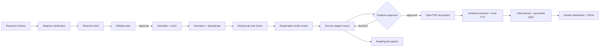

# Architecture

Domain objects are independent from terminals, providers, scholarly APIs, and SQLite. Pydantic
validation protects every model boundary. The service layer owns orchestration and persistence;
model providers never write files or call scholarly sources directly.

The Textual application is an adapter over the same planner and service contracts. It converts
validated state into immutable transcript cards, runs blocking provider/network work outside the UI
event loop, and owns only focus, overlays, command dispatch, and presentation state. The composer,
selection dialogs, paper picker, confirmation boundaries, and detail viewer do not bypass domain or
workspace validation.

Workspaces live in `.ragdoll/`. SQLite schema v3 stores restorable investigation snapshots, an
append-only event trail, evidence-document provenance, page-aware chunks, an FTS5 index, checkpointed
dossier sections, question history, and explicit plan/evidence approval records. Existing schema-v1
and schema-v2 workspaces migrate transactionally; legacy derived outputs remain readable but stale
until rebuilt under fingerprinted contracts.

Network acquisition, PDF parsing, model inference, persistence, and terminal rendering remain
separate boundaries. PDF extraction runs in an isolated Python subprocess with byte, page, and time
limits. External prompt editing launches `$VISUAL` or `$EDITOR` without a shell and uses a private,
bounded temporary file. The export layer reads only validated domain state.
