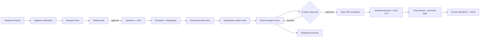

# Architecture

Domain objects are independent from terminals, providers, scholarly APIs, and SQLite. Pydantic
validation protects every model boundary. The service layer owns orchestration and persistence;
model providers never write files or call scholarly sources directly.

Workspaces live in `.ragdoll/`. SQLite schema v2 stores restorable investigation snapshots, an
append-only event trail, evidence-document provenance, page-aware chunks, an FTS5 index, checkpointed
dossier sections, and question history. Existing schema-v1 workspaces migrate transactionally.

Network acquisition, PDF parsing, model inference, persistence, and terminal rendering remain
separate boundaries. PDF extraction runs in an isolated Python subprocess with byte, page, and time
limits. The export layer reads only validated domain state.
