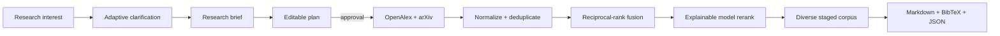

# Architecture

Domain objects are independent from terminals, providers, scholarly APIs, and SQLite. Pydantic
validation protects every model boundary. The service layer owns orchestration and persistence;
model providers never write files or call scholarly sources directly.

Workspaces live in `.ragdoll/`. SQLite stores restorable investigation snapshots plus an append-only
event trail. The export layer reads only validated domain state.
