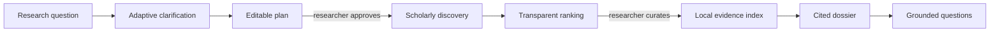

# Research, with receipts.

<div class="ragdoll-hero" markdown>

{ .ragdoll-hero-image }

**Turn an ambiguous research question into an explainable, cited literature dossier—from your
terminal.**

Human-approved search · transparent ranking · local evidence · passage-level citations

[Try the no-key demo](#try-the-real-workspace){ .md-button .md-button--primary }
[Watch the 2:37 video](https://www.youtube.com/watch?v=aytzIq-5S5k){ .md-button }
[View the Build Week entry](build-week.md){ .md-button }

</div>

RAGdoll is a keyboard-first workspace for planning scholarly searches, curating paper collections,
acquiring approved open evidence, and producing cited research dossiers. **The model proposes; the
researcher approves.** The application preserves the query, source, score, decision, evidence level,
and exact passage behind every accepted claim.

It never scrapes Google Scholar, bypasses paywalls, or says a paper was read when only metadata or
an abstract was available.

## Try the real workspace

Launch a deterministic sample of the actual Textual interface from GitHub:

```bash
uvx --from git+https://github.com/almondsun/ragdoll ragdoll demo --no-animation
```

The demo requires Python 3.11+ and an interactive terminal, but no API key, model download, or
scholarly API call after installation. It opens a temporary investigation with an approved plan,
three staged papers, indexed passages, a seven-section dossier, and resolvable citations.


[Open the judge guide](https://github.com/almondsun/ragdoll/blob/main/JUDGING.md){ .md-button }

## Where RAGdoll earns trust

<div class="ragdoll-grid" markdown>

### Human checkpoints

Search approval, paper curation, open-full-text consent, and evidence inspection remain separate
decisions. Changed inputs invalidate stale approvals and conclusions.

### Visible provenance

Every discovered work retains its exact query, source identifier, retrieval time, ranking
components, version group, and human staging decision.

### Evidence-level honesty

Metadata, abstract fallbacks, and open full text are labeled separately. Every accepted citation
resolves to a passage supplied for that model call.

</div>

## From question to cited dossier



OpenAlex provides broad scholarly discovery, Crossref canonicalizes DOI metadata, and arXiv enriches
preprint records. Reciprocal-rank fusion combines query results; DOI, arXiv, and normalized-title
fingerprints group versions. Open PDFs are acquired only after a second approval and indexed locally
with page-aware locators.


## A recorded end-to-end run

The preserved July 15, 2026 acceptance investigation exercises the full workflow.

| Result | Recorded value |
| --- | ---: |
| Discovery candidates | 24 |
| Human-curated papers | 6 |
| Open full-text documents | 5 |
| Labeled abstract fallbacks | 1 |
| Page-aware evidence chunks | 307 |
| Dossier sections | 7 |
| Directly supported claims in manual audit | 23 / 25 |

Every citation identifier resolved to evidence supplied for its model call. Two claims did not have
direct passage support in the manual audit and remain documented: citation integrity does not by
itself prove semantic entailment.

[Read the acceptance record](v1-reference-run.md){ .md-button .md-button--primary }
[See the evaluation contract](evaluation.md){ .md-button }

## Choose your path

<div class="ragdoll-grid" markdown>

### Use the product

Learn the [terminal experience](terminal-experience.md), then follow the
[judge guide](https://github.com/almondsun/ragdoll/blob/main/JUDGING.md) for the no-key demo, local
Ollama workflow, or OpenAI provider.

### Audit the research contract

Start with [planning](planning-contract.md), continue through
[retrieval and ranking](retrieval-and-ranking.md), then inspect the
[evidence and dossier contract](evidence-and-dossiers.md).

### Extend it safely

Read the [architecture](architecture.md) and [privacy model](privacy.md). Provider, scholarly-source,
storage, and terminal boundaries stay behind narrow adapters.

</div>

!!! info "Current status"
    `main` targets RAGdoll 2.2.0, whose release remains gated on the checked-in benchmark receiving
    maintainer-adjudicated relevance labels and passing every quality gate. Existing workspaces and
    export formats remain compatible.
