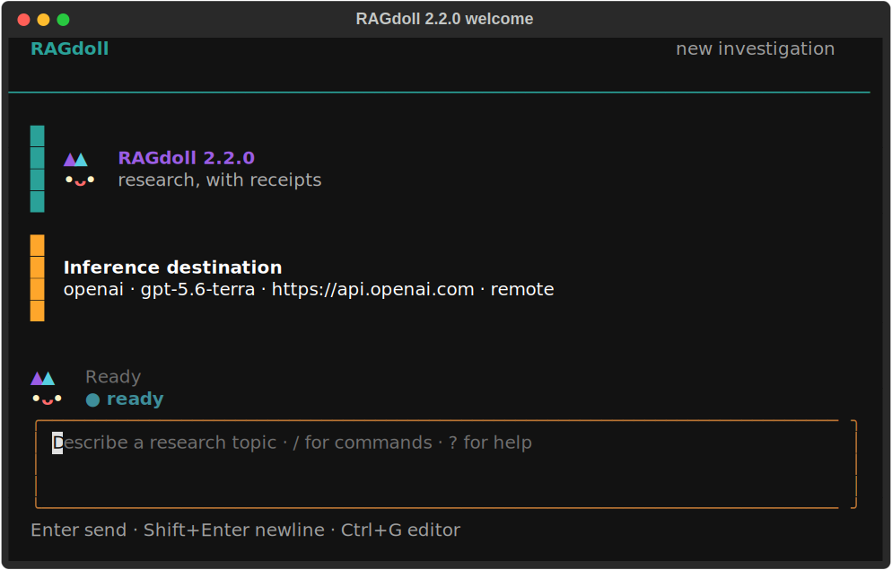

# Terminal experience

RAGdoll 2.0 is a fullscreen, conversation-first terminal application. It borrows proven interaction
patterns from the official Codex CLI, Claude Code, and GitHub Copilot CLI while retaining an
independent research workflow, color language, and A3 rag-doll identity.

## Screen contract

The interface has a compact header, a scrollable conversation timeline, one transient activity row,
a multiline composer, and a contextual footer. Plans, paper collections, dossiers, and grounded
answers appear as concise cards. Focus a card and press `Enter` to open the complete Markdown in a
scrollable overlay. No model reasoning is rendered.

Clarification, plan approval, paper staging, evidence acquisition, and destructive deletion are
separate focused dialogs. Long-running provider, scholarly-source, acquisition, and synthesis work
runs outside the rendering event loop. A provider operation already in flight is allowed to finish;
the UI does not pretend that a blocking remote request was cancelled.

The default appearance inherits the terminal background and foreground, then uses restrained teal,
copper, success, warning, and error accents. `NO_COLOR` selects monochrome output. `--no-animation`
keeps the mascot and activity mark static. Windows smaller than `80 x 24` show a resize overlay.

## Keyboard and commands

| Input | Action |
| --- | --- |
| `Enter` | Submit the composer or selected dialog item |
| `Shift+Enter`, `Ctrl+J` | Insert a newline |
| `Tab` | Complete the first matching slash command |
| `Up`, `Down` | Recall submitted input when the composer is single-line |
| `Ctrl+R` | Recall the latest history entry matching the draft |
| `Ctrl+G` | Edit the draft with `$VISUAL` or `$EDITOR` |
| `Ctrl+L` | Redraw the screen |
| `Esc` | Close the current overlay or picker |
| `Ctrl+C` | Clear a draft; press again on an empty idle composer to save and exit |
| `Ctrl+D` | Save and exit from an empty idle composer |
| `?` | Open contextual help from an empty composer |

The v2 in-app commands are `/plan`, `/papers`, `/dossier`, `/ask`, `/evidence`, `/sources`,
`/export`, `/purge`, `/help`, and `/quit`. Type `/` to see matching commands and descriptions.

## Migration from v1

Shell commands and persisted data remain compatible. The following interactive commands changed:

| RAGdoll 1.x | RAGdoll 2.0 |
| --- | --- |
| `/candidates`, `/staged` | `/papers`, then switch between All and Staged |
| `/inspect N` | `/papers`, focus a paper, then press `I` or choose Inspect |
| `/stage N`, `/unstage N` | `/papers`, then press `Space` |
| `/brief` | `/plan` |
| `/purge-evidence` | `/purge` |

Entering a removed v1 command produces a migration hint. Existing investigations and SQLite schema
v2 workspaces resume without conversion, and reading-list/dossier export formats are unchanged.

## Design references

- [OpenAI Codex CLI customization](https://learn.chatgpt.com/docs/cli-customization): composer,
  themes, animations, and external editing.
- [OpenAI Codex TUI source](https://github.com/openai/codex/tree/main/codex-rs/tui): immutable
  transcript cells, overlays, command dispatch, and derived busy state.
- [Claude Code interactive mode](https://code.claude.com/docs/en/interactive-mode): multiline input,
  history, detail inspection, and terminal-compatible shortcuts.
- [GitHub Copilot CLI command reference](https://docs.github.com/copilot/reference/copilot-cli-reference/cli-command-reference):
  discoverable slash commands, compact timelines, and keyboard-first navigation.

These references define interaction expectations only. RAGdoll does not reuse their names,
mascots, source code, or visual assets.
